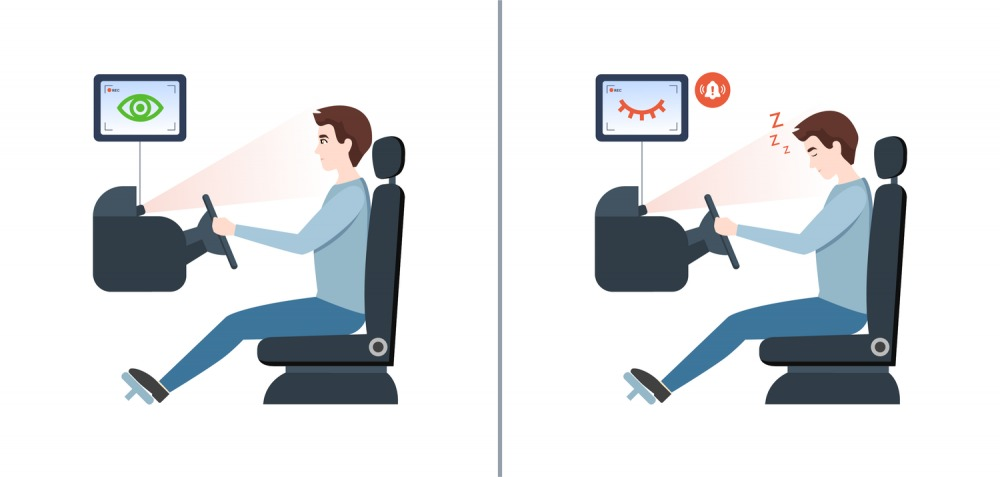
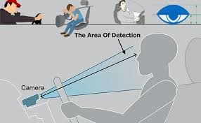
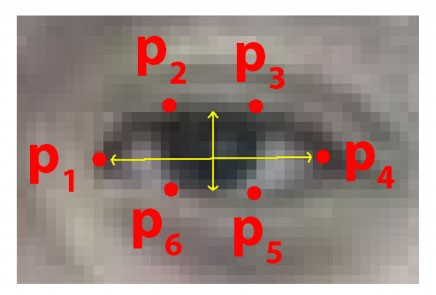
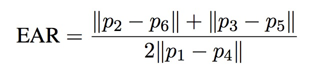
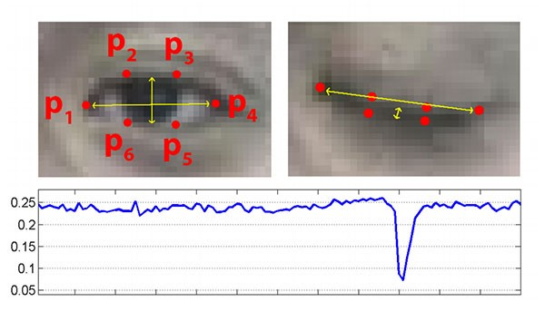

# DATA SCIENCE PROJECT-1 ABSTRACT
# Drowsiness Detection System

### Team members: 
- Ishita Sehgal (22067)
- Prerna Gupta (22118)

### Problem Statement:
Fatigue and drowsiness not just because of alcohol and drugs but also because of tiredness due to long driving hours, is a big cause of road accidents. 
Solution
A system which alarms the driver as soon as it detects yawning and shutting of eyes when the driver is becoming drowsy to prevent any accident.

### Applications 
This can be used by riders who tend to drive for a longer period of time that may lead to accidents.

### Technology Used

- PYTHON: Python is an interpreted, high-level, general-purpose programming language. Python's design philosophy emphasizes code readability with its notable use of significant whitespace. Its language constructs and object-oriented approach aim to help programmers write clear, logical code for small and large-scale projects. Python is dynamically typed and supports multiple programming paradigms, including procedural, object-oriented, and functional programming. 

- JUPYTER Lab: Project Jupyter is a nonprofit organization created to develop open-source software, open-standards, and services for interactive computing across dozens of programming languages. 

- IMAGE PROCESSING: In computer science, digital image processing is the use of computer algorithms to perform image processing on digital images.

- MACHINE LEARNING: Machine learning is the scientific study of algorithms and statistical models that computer systems use in order to perform a specific task effectively without using explicit instructions, relying on patterns and inference instead. It is seen as a subset of artificial intelligence. Machine learning algorithms build a mathematical model based on sample data, known as "training data", in order to make predictions or decisions without being explicitly told.

### Hardware Requirements Specification 
- Laptop with basic hardware. 
- Webcam

### Dependencies
- import cv2
- import imutils
- import dlib
- import scipy

### Description 
A computer vision system that can automatically detect driver drowsiness in a real-time video stream and then play an alarm if the driver appears to be drowsy.

### Algorithm 
Each eye is represented by 6 (x, y)-coordinates, starting at the left-corner of the eye (as if you were looking at the person), and then working clockwise around the eye.
It checks 20 consecutive frames and if the Eye Aspect ratio is less than 0.25, Alert is generated.

### Relationship

### Summary

